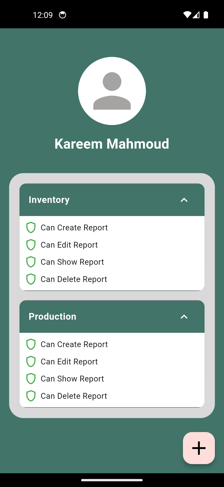

# ERP System

A mobile ERP companion app for managing pasta factory operations efficiently.  
Built using Flutter and Dart for the frontend, with a Laravel API backend and MySQL database.

---

## Features

- Real-time data updates and notifications  
- Multi-platform support (iOS, Android)  
- User-friendly dashboard for reports and production tracking  
- Employee management and task scheduling through calendar  
- Secure login and role-based access  

---
## 📸 Screenshots

### 🔐 Login Page


### 📊 Reports Page


### 🏭 Daily Production Page


### 📆 Events Calendar


### 🔔 Notifications Page


### 👷 Add Worker Page


---

## Tech Stack

- Flutter  
- Dart  
- Laravel API  
- MySQL  

---

## Project Status

- UI design is complete  
- Backend logic and integration are in progress  

---

## How to Run

```bash
flutter pub get
flutter run
